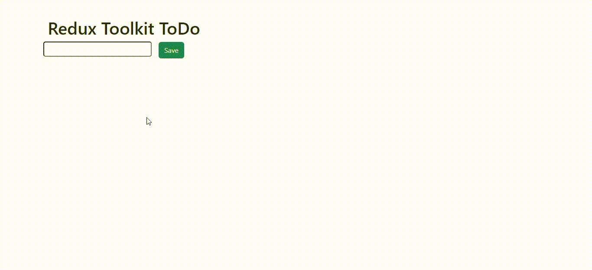

# REDUX TOOLKIT TODO

## PROJE TANITIMI

Redux Toolkit ile basit bir todo list tasarlanmıştır. Todo ekleme, silme ve yapıldı/yapılmadı olarak işaretleme işlemleri yapılmıştır.

## KULLANILAN DİLLER VE KÜTÜPHANELER

-HTML  
-CSS  
-JS  
-React  
-Redux Toolkit  
-Boostrap  

<h2> Proje önizlemisi </h2>

